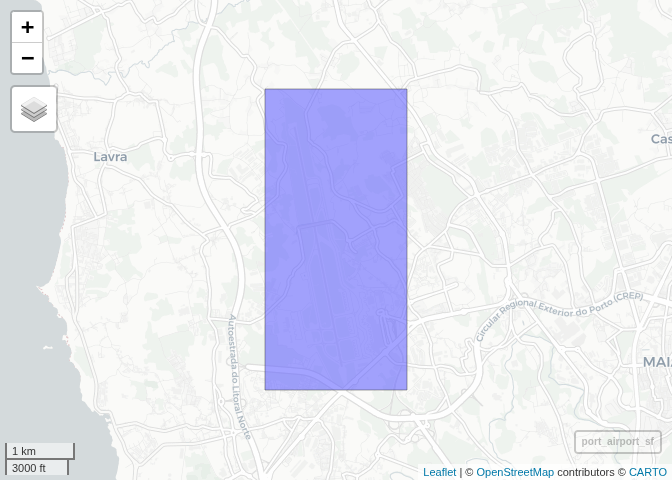
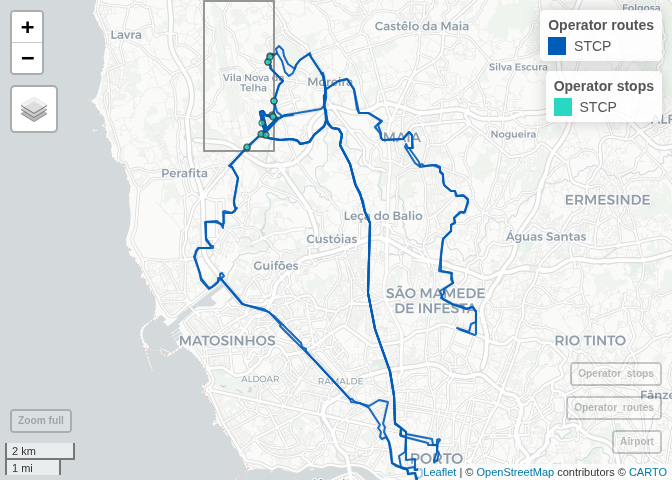

# Bus services at Porto airport

    library(tidytransit)

## Load Porto airport bbox from OSM

STCP:
<https://opendata.porto.digital/dataset/horarios-paragens-e-rotas-em-formato-gtfs-stcp/resource/415bf8d5-4c18-40b3-9516-9d9187185ef9?inner_span=True>
Flixbus: <https://mobilitydatabase.org/feeds/gtfs/mdb-853>

    library(osmdata)

    ## Data (c) OpenStreetMap contributors, ODbL 1.0. https://www.openstreetmap.org/copyright

    bbox_porto_airport = getbb("Aeroporto Francisco Sá Carneiro, Porto, Portugal")
    bbox_porto_airport

    ##         min       max
    ## x -8.690304 -8.666056
    ## y 41.229439 41.268228

    # Preview with mapview
    library(mapview)
    library(sf)

    ## Linking to GEOS 3.12.1, GDAL 3.8.4, PROJ 9.4.0; sf_use_s2() is TRUE

    port_airport_sf = st_as_sfc(st_bbox(c(xmin = bbox_porto_airport[1,1],
                                          ymin = bbox_porto_airport[2,1],
                                          xmax = bbox_porto_airport[1,2],
                                          ymax = bbox_porto_airport[2,2]),
                                    crs = 4326))
    mapview(port_airport_sf)

    ## PhantomJS not found. You can install it with webshot::install_phantomjs(). If it is installed, please make sure the phantomjs executable can be found via the PATH variable.

    ## file:////tmp/Rtmpcf01GF/file1fd9aaff5196/widget1fd9a36907e91.html screenshot completed

## Load data

    feeds <- read.csv("trips_serving_area.csv", stringsAsFactors = FALSE)
    feeds$start <- as.Date(feeds$start)
    feeds$end   <- as.Date(feeds$end)
    feeds$shapes <- as.logical( feeds$shapes )
    feeds

    ##   operator      start        end shapes
    ## 1     STCP 2024-01-01 2024-06-14   TRUE
    ## 2     STCP 2024-09-07 2024-12-31  FALSE
    ## 3  Flixbus 2025-12-01 2025-12-31   TRUE
    ## 4    Autna 2025-12-01 2025-12-31   TRUE
    ## 5    Metro 2025-12-01 2025-12-31   TRUE
    ##                                                                                                                                                                    url
    ## 1             https://opendata.porto.digital/dataset/5275c986-592c-43f5-8f87-aabbd4e4f3a4/resource/f6b85210-3b86-4617-8327-405f50791cf0/download/gtfs-stcp-2023-09.zip
    ## 2 https://opendata.porto.digital/dataset/5275c986-592c-43f5-8f87-aabbd4e4f3a4/resource/53b24b02-108a-453d-b381-2354c482efe8/download/horarios_gtfs_stcp_16_09_2024.zip
    ## 3                                                                                                              https://transport.beta.gouv.fr/resources/11681/download
    ## 4                                                                                     https://drive.google.com/uc?export=download&id=1gah1x10RyFu7gJPweBcCXPd9vcFJFQ7c
    ## 5                                                                          https://files.mobilitydatabase.org/mdb-2357/mdb-2357-202502052244/mdb-2357-202502052244.zip

    # Subset to first row only
    feeds <- feeds[1, ]
    # Filkter by operator="Flixbus"
    # feeds <- feeds[feeds$operator == "Flixbus", ]
    # feeds <- feeds[feeds$operator == "Autna", ]
    # Subset to rows 1 and 3
    # feeds <- feeds[c(1,3,4,5), ]
    feeds

    ##   operator      start        end shapes
    ## 1     STCP 2024-01-01 2024-06-14   TRUE
    ##                                                                                                                                                        url
    ## 1 https://opendata.porto.digital/dataset/5275c986-592c-43f5-8f87-aabbd4e4f3a4/resource/f6b85210-3b86-4617-8327-405f50791cf0/download/gtfs-stcp-2023-09.zip

## Process GTFS

    trips <- data.frame()

    aggregated_shapes = data.frame()
    aggregated_stops = data.frame()

    for (i in seq_len(nrow(feeds))) {
      op   <- feeds$operator[i]
      url  <- feeds$url[i]
      s    <- feeds$start[i]
      e    <- feeds$end[i]
      
      message("=== Processing operator: ", op, " for period ", s, " to ", e, " ===")
      message("Reading GTFS...")
      gtfs_raw <- read_gtfs(url)
      # summary(gtfs_raw)
      
      message("Filtering feed by airport area...")
      gtfs_airport <- gtfs_raw |> filter_feed_by_area(bbox_porto_airport)
      summary(gtfs_airport)
      
      # For each day of 2024, count trips
      for (day in seq(s, e, by="day")) {
        
        message("Processing date: ", as.Date(day))
        # Try and if error, log error 
        gtfs_filtered = tryCatch({
          suppressWarnings({gtfs_airport |> 
            filter_feed_by_date(day)
          })
        }, error = function(e) {
          message("Error filtering feed by date: ", as.Date(day))
          return(NULL)
        })
        if(!is.null(gtfs_filtered)) {
          # Add row to trips with count of trips
          n_trips <- nrow(gtfs_filtered$trips)
          # message("Number of trips on ", as.Date(day), ": ", n_trips)
          trips <- rbind(trips, data.frame(
            operator = op,
            day = as.Date(day),
            total_trips = n_trips,
            stringsAsFactors = FALSE
          ))
        }
      }
      
      if (feeds$shapes[i]) {
        message("Aggregating shapes...")
        shapes_sf <- shapes_as_sf(gtfs_airport$shapes)
        shapes_sf$operator <- op
        aggregated_shapes <- rbind(aggregated_shapes, shapes_sf |> dplyr::select(operator, shape_id, geometry))
        
        stops_sf <- stops_as_sf(gtfs_airport$stops) |> # Filter inside port_airport_sf bbox
          st_intersection(port_airport_sf)
        stops_sf$operator <- op
        aggregated_stops <- rbind(aggregated_stops, stops_sf |> dplyr::select(operator, stop_id, stop_code,stop_name))
      }
    }

    ## === Processing operator: STCP for period 2024-01-01 to 2024-06-14 ===

    ## Reading GTFS...

    ## Filtering feed by airport area...

    ## tidygtfs object
    ## files        agency, routes, stop_times, trips, shapes, transfers, calendar, calendar_dates, stops
    ## agency       Sociedade Transportes Colectivos do Porto
    ## service      from 2023-09-09 to 2024-06-14
    ## uses         stop_times (no frequencies)
    ## # routes       4
    ## # trips      507
    ## # stop_ids   277
    ## # stop_names 160
    ## # shapes       8

    ## Processing date: 2024-01-01

    ## Processing date: 2024-01-02

    ## Processing date: 2024-01-03

    ## Processing date: 2024-01-04

    ## Processing date: 2024-01-05

    ## Processing date: 2024-01-06

    ## Processing date: 2024-01-07

    ## Processing date: 2024-01-08

    ## Processing date: 2024-01-09

    ## Processing date: 2024-01-10

    ## Processing date: 2024-01-11

    ## Processing date: 2024-01-12

    ## Processing date: 2024-01-13

    ## Processing date: 2024-01-14

    ## Processing date: 2024-01-15

    ## Processing date: 2024-01-16

    ## Processing date: 2024-01-17

    ## Processing date: 2024-01-18

    ## Processing date: 2024-01-19

    ## Processing date: 2024-01-20

    ## Processing date: 2024-01-21

    ## Processing date: 2024-01-22

    ## Processing date: 2024-01-23

    ## Processing date: 2024-01-24

    ## Processing date: 2024-01-25

    ## Processing date: 2024-01-26

    ## Processing date: 2024-01-27

    ## Processing date: 2024-01-28

    ## Processing date: 2024-01-29

    ## Processing date: 2024-01-30

    ## Processing date: 2024-01-31

    ## Processing date: 2024-02-01

    ## Processing date: 2024-02-02

    ## Processing date: 2024-02-03

    ## Processing date: 2024-02-04

    ## Processing date: 2024-02-05

    ## Processing date: 2024-02-06

    ## Processing date: 2024-02-07

    ## Processing date: 2024-02-08

    ## Processing date: 2024-02-09

    ## Processing date: 2024-02-10

    ## Processing date: 2024-02-11

    ## Processing date: 2024-02-12

    ## Processing date: 2024-02-13

    ## Processing date: 2024-02-14

    ## Processing date: 2024-02-15

    ## Processing date: 2024-02-16

    ## Processing date: 2024-02-17

    ## Processing date: 2024-02-18

    ## Processing date: 2024-02-19

    ## Processing date: 2024-02-20

    ## Processing date: 2024-02-21

    ## Processing date: 2024-02-22

    ## Processing date: 2024-02-23

    ## Processing date: 2024-02-24

    ## Processing date: 2024-02-25

    ## Processing date: 2024-02-26

    ## Processing date: 2024-02-27

    ## Processing date: 2024-02-28

    ## Processing date: 2024-02-29

    ## Processing date: 2024-03-01

    ## Processing date: 2024-03-02

    ## Processing date: 2024-03-03

    ## Processing date: 2024-03-04

    ## Processing date: 2024-03-05

    ## Processing date: 2024-03-06

    ## Processing date: 2024-03-07

    ## Processing date: 2024-03-08

    ## Processing date: 2024-03-09

    ## Processing date: 2024-03-10

    ## Processing date: 2024-03-11

    ## Processing date: 2024-03-12

    ## Processing date: 2024-03-13

    ## Processing date: 2024-03-14

    ## Processing date: 2024-03-15

    ## Processing date: 2024-03-16

    ## Processing date: 2024-03-17

    ## Processing date: 2024-03-18

    ## Processing date: 2024-03-19

    ## Processing date: 2024-03-20

    ## Processing date: 2024-03-21

    ## Processing date: 2024-03-22

    ## Processing date: 2024-03-23

    ## Processing date: 2024-03-24

    ## Processing date: 2024-03-25

    ## Processing date: 2024-03-26

    ## Processing date: 2024-03-27

    ## Processing date: 2024-03-28

    ## Processing date: 2024-03-29

    ## Processing date: 2024-03-30

    ## Processing date: 2024-03-31

    ## Processing date: 2024-04-01

    ## Processing date: 2024-04-02

    ## Processing date: 2024-04-03

    ## Processing date: 2024-04-04

    ## Processing date: 2024-04-05

    ## Processing date: 2024-04-06

    ## Processing date: 2024-04-07

    ## Processing date: 2024-04-08

    ## Processing date: 2024-04-09

    ## Processing date: 2024-04-10

    ## Processing date: 2024-04-11

    ## Processing date: 2024-04-12

    ## Processing date: 2024-04-13

    ## Processing date: 2024-04-14

    ## Processing date: 2024-04-15

    ## Processing date: 2024-04-16

    ## Processing date: 2024-04-17

    ## Processing date: 2024-04-18

    ## Processing date: 2024-04-19

    ## Processing date: 2024-04-20

    ## Processing date: 2024-04-21

    ## Processing date: 2024-04-22

    ## Processing date: 2024-04-23

    ## Processing date: 2024-04-24

    ## Processing date: 2024-04-25

    ## Processing date: 2024-04-26

    ## Processing date: 2024-04-27

    ## Processing date: 2024-04-28

    ## Processing date: 2024-04-29

    ## Processing date: 2024-04-30

    ## Processing date: 2024-05-01

    ## Processing date: 2024-05-02

    ## Processing date: 2024-05-03

    ## Processing date: 2024-05-04

    ## Processing date: 2024-05-05

    ## Processing date: 2024-05-06

    ## Processing date: 2024-05-07

    ## Processing date: 2024-05-08

    ## Processing date: 2024-05-09

    ## Processing date: 2024-05-10

    ## Processing date: 2024-05-11

    ## Processing date: 2024-05-12

    ## Processing date: 2024-05-13

    ## Processing date: 2024-05-14

    ## Processing date: 2024-05-15

    ## Processing date: 2024-05-16

    ## Processing date: 2024-05-17

    ## Processing date: 2024-05-18

    ## Processing date: 2024-05-19

    ## Processing date: 2024-05-20

    ## Processing date: 2024-05-21

    ## Processing date: 2024-05-22

    ## Processing date: 2024-05-23

    ## Processing date: 2024-05-24

    ## Processing date: 2024-05-25

    ## Processing date: 2024-05-26

    ## Processing date: 2024-05-27

    ## Processing date: 2024-05-28

    ## Processing date: 2024-05-29

    ## Processing date: 2024-05-30

    ## Processing date: 2024-05-31

    ## Processing date: 2024-06-01

    ## Processing date: 2024-06-02

    ## Processing date: 2024-06-03

    ## Processing date: 2024-06-04

    ## Processing date: 2024-06-05

    ## Processing date: 2024-06-06

    ## Processing date: 2024-06-07

    ## Processing date: 2024-06-08

    ## Processing date: 2024-06-09

    ## Processing date: 2024-06-10

    ## Processing date: 2024-06-11

    ## Processing date: 2024-06-12

    ## Processing date: 2024-06-13

    ## Processing date: 2024-06-14

    ## Aggregating shapes...

    ## Warning: attribute variables are assumed to be spatially constant throughout
    ## all geometries

    # Group by operator name, summing counts
    library(dplyr)

    ## 
    ## Attaching package: 'dplyr'

    ## The following objects are masked from 'package:stats':
    ## 
    ##     filter, lag

    ## The following objects are masked from 'package:base':
    ## 
    ##     intersect, setdiff, setequal, union

    operator_totals <- trips |> dplyr::group_by(operator) |> dplyr::summarise(
      total_trips = sum(total_trips),
      start = min(day),
      end = max(day), 
      n_days = n()
    )
    operator_totals

    ## # A tibble: 1 × 5
    ##   operator total_trips start      end        n_days
    ##   <chr>          <int> <date>     <date>      <int>
    ## 1 STCP           31736 2024-01-01 2024-06-14    166

## Display shapes

    # Set operator==STCP color to 005CB9FF
    aggregated_shapes[aggregated_shapes$operator == "STCP", "color"] <- "#005CB9"
    aggregated_shapes[aggregated_shapes$operator == "Autna", "color"] <- "#FFEC00"
    aggregated_shapes[aggregated_shapes$operator == "Flixbus", "color"] <- "#73a400"
    aggregated_shapes[aggregated_shapes$operator == "Metro", "color"] <- "#645B92"
    aggregated_shapes

    ## Simple feature collection with 8 features and 3 fields
    ## Geometry type: LINESTRING
    ## Dimension:     XY
    ## Bounding box:  xmin: -8.693555 ymin: 41.14481 xmax: -8.596425 ymax: 41.25653
    ## Geodetic CRS:  WGS 84
    ##   operator    shape_id                       geometry   color
    ## 1     STCP  3M_0_1_shp LINESTRING (-8.611237 41.14... #005CB9
    ## 2     STCP  3M_1_1_shp LINESTRING (-8.670114 41.23... #005CB9
    ## 3     STCP 601_0_1_shp LINESTRING (-8.615358 41.14... #005CB9
    ## 4     STCP 601_1_1_shp LINESTRING (-8.670077 41.23... #005CB9
    ## 5     STCP 602_0_1_shp LINESTRING (-8.615361 41.14... #005CB9
    ## 6     STCP 602_1_1_shp LINESTRING (-8.670193 41.23... #005CB9
    ## 7     STCP 604_0_1_shp LINESTRING (-8.602091 41.18... #005CB9
    ## 8     STCP 604_1_1_shp LINESTRING (-8.670157 41.23... #005CB9

    aggregated_stops[aggregated_stops$operator == "STCP", "color"] <- "#28D8C3"
    aggregated_stops[aggregated_stops$operator == "Autna", "color"] <- "#FFB300"
    aggregated_stops[aggregated_stops$operator == "Flixbus", "color"] <- "#A1C349"
    aggregated_stops[aggregated_stops$operator == "Metro", "color"] <- "#9E90C7"
    aggregated_stops

    ## Simple feature collection with 16 features and 5 fields
    ## Geometry type: POINT
    ## Dimension:     XY
    ## Bounding box:  xmin: -8.67546 ymin: 41.23031 xmax: -8.666073 ymax: 41.25395
    ## Geodetic CRS:  WGS 84
    ## # A tibble: 16 × 6
    ##    operator stop_id stop_code stop_name                   geometry color  
    ##    <chr>    <chr>   <chr>     <chr>                    <POINT [°]> <chr>  
    ##  1 STCP     BRRO4   BRRO4     BARREIRO        (-8.669106 41.23357) #28D8C3
    ##  2 STCP     PRU3    PRU3      PEDRAS RUBRAS   (-8.666833 41.23875) #28D8C3
    ##  3 STCP     BRRO1   BRRO1     BARREIRO        (-8.670266 41.23392) #28D8C3
    ##  4 STCP     PRU1    PRU1      PEDRAS RUBRAS    (-8.66656 41.23846) #28D8C3
    ##  5 STCP     BRRO2   BRRO2     BARREIRO        (-8.670572 41.23389) #28D8C3
    ##  6 STCP     FRA1    FRA1      FEIRA           (-8.666194 41.24236) #28D8C3
    ##  7 STCP     TLHA1   TLHA1     TELHEIRA         (-8.67546 41.23031) #28D8C3
    ##  8 STCP     AEPT1   AEPT1     AEROPORTO       (-8.670326 41.23689) #28D8C3
    ##  9 STCP     LIDM1   LIDM1     LIDADOR (METRO) (-8.667655 41.25395) #28D8C3
    ## 10 STCP     RRIB1   RRIB1     R.RIBEIRO       (-8.668127 41.25239) #28D8C3
    ## 11 STCP     RRIB2   RRIB2     R.RIBEIRO       (-8.668044 41.25248) #28D8C3
    ## 12 STCP     FRA2    FRA2      FEIRA           (-8.666073 41.24243) #28D8C3
    ## 13 STCP     TLHA2   TLHA2     TELHEIRA        (-8.675405 41.23051) #28D8C3
    ## 14 STCP     BRRO3   BRRO3     BARREIRO        (-8.669047 41.23371) #28D8C3
    ## 15 STCP     LIDM2   LIDM2     LIDADOR (METRO)   (-8.6676 41.25389) #28D8C3
    ## 16 STCP     PRU2    PRU2      PEDRAS RUBRAS   (-8.666531 41.23819) #28D8C3

    # port_airport_sftransparent, with border #8c8c8c
    map = mapview(port_airport_sf, color = "#8c8c8c", lwd=2, alpha.regions=0, layer.name="Airport") +
      mapview(aggregated_shapes, zcol = "operator", color=aggregated_shapes$color, layer.name="Operator routes") +
      mapview(aggregated_stops, zcol = "operator", col.regions=aggregated_stops$color, cex=3, layer.name="Operator stops")

    map

    ## file:////tmp/Rtmpcf01GF/file1fd9a6e223cdd/widget1fd9a7d397b8d.html screenshot completed

    # Store map on html file
    # mapshot(map, "maria_gtfs_porto_map.html")
